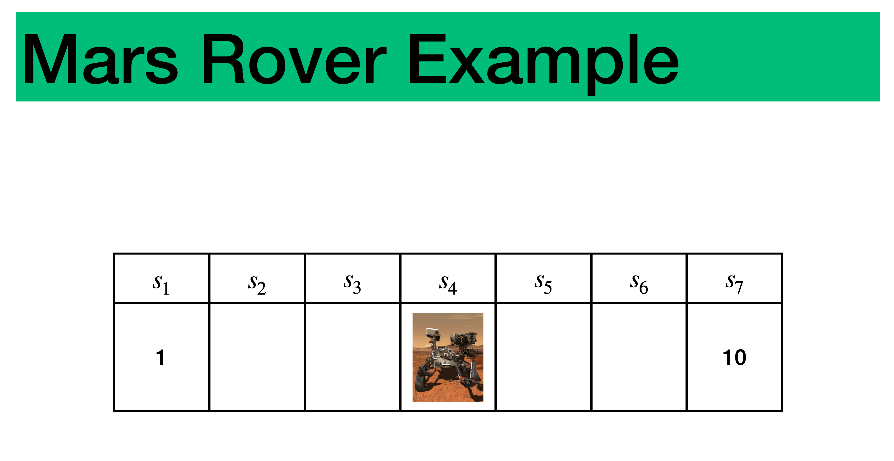

<figure style="text-align:center;">
  
  <figcaption><strong>Figure:</strong> A rover navigating a linear Martian landscape.</figcaption>
</figure>

# Mars Rover: Control and Prediction

This repository showcases an implementation of the **Mars Rover Environment**, designed to provide a practical and accessible setting for studying reinforcement learning (RL) methods. Through a simulated linear Martian landscape, key RL techniques are analyzed to optimize the rover's navigation and task performance.

---

## Highlights

1. **Mars Rover Environment**
   - A stochastic environment modeling rover navigation across multiple states.
   - Implemented with customizable parameters for transition probabilities (`p_stay`, `p_backward`) and goal states.

2. **Reinforcement Learning Algorithms**
   - **TD(0):** Prediction of state-value functions using one-step temporal difference learning.
   - **First-Visit Monte Carlo (FVMC):** Estimates of state values via episodic sampling.
   - **SARSA:** On-policy learning based on state–action transitions.
   - **Q-Learning:** Off-policy learning for maximizing returns.
   - **Double Q-Learning:** Mitigates overestimation bias while learning efficient policies.

3. **Benchmarking with Dynamic Programming**
   - Includes **Value Iteration** for optimal policy and value function calculation.
   - Allows comparisons between learned and optimal value functions.

4. **Hyperparameter Studies**
   - Evaluates the impact of step-size (`α`) and exploration rate (`ε`) on algorithm performance.
   - Supports both constant and decaying schedules for adaptive learning rates.

5. **Comprehensive Visualization**
   - RMSE curves to track learning progress.
   - State-value function snapshots and evolutions during learning.
   - Metrics for success rates, returns, and regret accumulation.

---

## Repository Structure

- `Mars_Rover_env.py` — Core environment definition for state transitions, rewards, and actions.
- `Mars_Rover_control.ipynb` — Experiments with RL algorithms like SARSA and Q-Learning.
- `Mars_Rover_predict.ipynb` — Comparisons between Monte Carlo and TD(0).
- `rover.png` — Visual representation of the rover environment.

---

## Setup Instructions

1. Clone the repository:
   ```bash
   git clone https://github.com/MathPhysSim/MARS_ROVER.git
   cd MARS_ROVER
   ```
2. Install required dependencies:
   ```bash
   conda install --file requirements.txt
   ```
3. Run Jupyter Notebook:
   ```bash
   jupyter notebook
   ```
4. Open and execute the notebooks:
   - **`Mars_Rover_control.ipynb`**
   - **`Mars_Rover_predict.ipynb`**

---

## How to Use

1. **Initialize the Environment**:
   ```python
   from Mars_Rover_env import MarsRoverEnv
   env = MarsRoverEnv(p_stay=1/3, p_backward=1/6)
   ```
2. **Select a Policy**:
   ```python
   policy = lambda s: 0 if s % 2 == 0 else 1  # Example policy
   ```
3. **Run Learning Algorithms**:
   - Use the functions implemented in the notebooks (e.g., `td()` or `mc_prediction()`).
   ```python
   # Example usage
   V_td, _, _ = td(policy, env, gamma=0.99, n_episodes=500)
   ```
4. **Visualize Results**:
   - Plotting functions embedded in the notebooks can help visualize progress, such as value function evolution or learning curves.

---

## Additional Resources

Explore the complete implementation and contributions in the GitHub repository:  
[https://github.com/MathPhysSim/MARS_ROVER](https://github.com/MathPhysSim/MARS_ROVER)

---

## Authors

**Simon Hirlaender, Dipl.-Ing. Dr., BSc**  
- Role: Head of **SARL Team**, IDA Lab, University of Salzburg  
- Expertise: Reinforcement learning, dynamic optimization, control systems  
- Contact: [simon.hirlaender@plus.ac.at](mailto:simon.hirlaender@plus.ac.at)

**Olga Mironova, BA MSc**  
- Role: Researcher, IDA Lab, University of Salzburg  
- Expertise: Machine learning and intelligent systems  
- Contact: [olga.mironova@plus.ac.at](mailto:olga.mironova@plus.ac.at)

---

## Institutional Support

The developments are supported by **IDA Lab** at the University of Salzburg, with projects led by the **Smart Analytics & Reinforcement Learning (SARL)** team.

Learn more about:
- [IDA Lab](https://ida.cs.sbg.ac.at/)
- [SARL Team](https://www.plus.ac.at/aihi/der-fachbereich/ida-lab/teams/sarl/?lang=en)

---